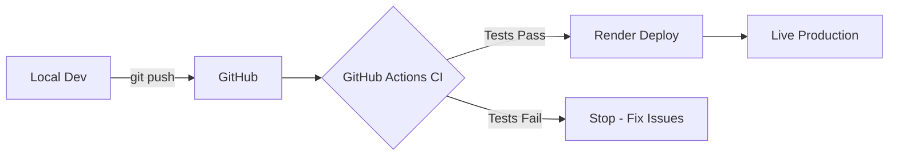

# 🚀 CI/CD Guide for Class Notes PWA

## Current Setup

### Continuous Deployment (CD)
You already have CD working:
1. **Push to GitHub** → 2. **Render auto-deploys**

This happens automatically when you push to the `main` branch.

## How CI/CD Works

### CI (Continuous Integration)
Tests and validates your code BEFORE it deploys:
- ✅ Code builds successfully
- ✅ TypeScript has no errors  
- ✅ Tests pass (when you add them)
- ✅ Security vulnerabilities checked

### CD (Continuous Deployment)
Automatically deploys validated code:
- ✅ Already working via Render
- ✅ Zero-downtime deployments
- ✅ Automatic rollback if deploy fails

## Your Pipeline Flow



## GitHub Actions We Added

### 1. Main CI Pipeline (`.github/workflows/ci.yml`)
Runs on every push:
- Installs dependencies
- Builds TypeScript
- Runs tests (when you add them)
- Security audit

### 2. PR Checks (`.github/workflows/pr-checks.yml`)
Runs on pull requests:
- Ensures code builds
- Tests Docker image
- Checks for code quality issues

## Benefits

1. **Catch Bugs Early**: TypeScript errors caught before deploy
2. **Confidence**: Know your code works before it goes live
3. **Team Collaboration**: PRs are checked automatically
4. **Security**: Vulnerabilities detected automatically

## How to Use

### For Regular Development:
```bash
# Work on feature
git checkout -b new-feature
# Make changes
git add .
git commit -m "Add awesome feature"
git push origin new-feature
# Create PR on GitHub - CI runs automatically
```

### For Direct Deployment:
```bash
# Work on main branch
git add .
git commit -m "Fix bug"
git push  # CI runs, then Render deploys
```

## Adding Tests

When you're ready to add tests:

```bash
npm install --save-dev jest @types/jest ts-jest
```

Create `jest.config.js`:
```javascript
module.exports = {
  preset: 'ts-jest',
  testEnvironment: 'node',
  roots: ['<rootDir>/src'],
  testMatch: ['**/__tests__/**/*.ts', '**/*.test.ts'],
};
```

Update package.json:
```json
"scripts": {
  "test": "jest",
  "test:watch": "jest --watch"
}
```

## Monitoring Your CI/CD

1. **GitHub Actions**: Check the "Actions" tab in your repo
2. **Render Dashboard**: See deployment status
3. **Email Notifications**: Get notified of failures

## Best Practices

1. **Always run locally first**: `npm run build` before pushing
2. **Use feature branches**: Don't push directly to main
3. **Write tests**: As you add features, add tests
4. **Monitor deployments**: Check Render logs after deploy

## Common Issues

### "CI Failed"
- Check GitHub Actions logs
- Usually TypeScript errors
- Fix locally, push again

### "Deploy Failed on Render"  
- Check Render logs
- Usually missing environment variables
- Or database connection issues

## Next Steps

1. **Add actual tests** when you have time
2. **Add code formatting** (Prettier)
3. **Add linting** (ESLint)
4. **Set up staging environment**

Your CI/CD is now production-ready! 🎉